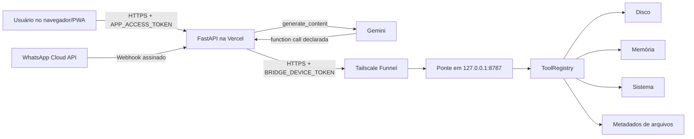

# Arquitetura e funcionamento

## Visão geral

O projeto separa conversa, provedor de IA e execução de ferramentas. O modelo Gemini nunca executa código diretamente: ele apenas solicita uma ferramenta declarada, e o `Agent` encaminha essa solicitação a um executor com lista fechada.

## Componentes

| Arquivo/componente | Responsabilidade |
|---|---|
| `app/agent.py` | Laço mensagem → resposta → ferramentas → resposta final, limitado a cinco rodadas |
| `app/providers/base.py` | Contrato independente de provedor |
| `app/providers/gemini_provider.py` | Adaptação para `google-genai`, histórico, function calling e fallback 429/503 |
| `app/chat_service.py` | Até 100 sessões LRU em memória, uma instância de agente por sessão |
| `app/server.py` | PWA, API, autenticação do app, health check e webhook WhatsApp |
| `app/bridge.py` | API local autenticada que expõe somente ferramentas aprovadas |
| `app/tools/registry.py` | Lista fechada, esquema de parâmetros, despacho e auditoria |
| `app/tools/remote.py` | Cliente HTTPS usado pela Vercel para conversar com a ponte |
| `public/` | Interface PWA, manifest, service worker, estilos e páginas legais públicas |
| `systemd/` | Inicialização automática local |

## Fluxo de uma mensagem comum

1. A PWA cria ou recupera `session_id` no `localStorage`.
2. O usuário informa `APP_ACCESS_TOKEN` nas configurações; ele permanece no dispositivo.
3. A PWA envia `POST /api/chat` com JSON e `Authorization: Bearer ...`.
4. `server.py` valida o token e obtém a sessão no `ChatService`.
5. `GeminiProvider` envia histórico, instrução de sistema e declarações de ferramentas ao Gemini.
6. Se o Gemini responder com texto, esse texto volta à PWA.
7. Se solicitar ferramenta, o `Agent` executa o ciclo descrito abaixo.

## Fluxo de uma ferramenta local

Exemplo: “Qual é meu espaço em disco?”

1. Gemini solicita `get_disk_space`.
2. `Agent` chama o executor configurado.
3. Em produção, o executor é `RemoteToolRegistry` porque `BRIDGE_URL` e `BRIDGE_DEVICE_TOKEN` existem.
4. A Vercel envia `POST {BRIDGE_URL}/tools/execute` por HTTPS.
5. Tailscale Funnel encaminha a requisição para `127.0.0.1:8787`.
6. `bridge.py` compara o Bearer token em tempo constante.
7. `ToolRegistry` rejeita nomes e parâmetros não permitidos.
8. A ferramenta coleta somente o dado autorizado e devolve JSON.
9. O resultado volta ao Gemini como `function_response` com papel `user`.
10. Gemini redige a resposta em português sem inventar dados.

## Ferramentas disponíveis

| Nome | Retorno | Observação |
|---|---|---|
| `get_disk_space` | total, usado, livre e percentual | Usa o volume que contém `ALLOWED_DIRECTORY` |
| `get_memory_usage` | memória total, usada, disponível e percentual | Usa `psutil` |
| `get_system_info` | SO, versão, arquitetura, hostname e Python | Somente metadados |
| `list_files` | caminho, nomes, tipos e tamanhos | Não lê conteúdo e não segue links |

Não existem ferramentas para shell, comandos, leitura de arquivo, upload, escrita, exclusão, câmera, microfone ou controle da tela.

## Escolha do executor

`get_tool_registry()` aplica estas regras:

1. Se `BRIDGE_URL` e `BRIDGE_DEVICE_TOKEN` existirem, usa a ponte remota.
2. Se estiver na Vercel sem ponte, usa `EmptyToolRegistry` e não lê a máquina da nuvem.
3. Fora da Vercel, usa `ToolRegistry` local.

Essa decisão evita o erro inicial em que o agente poderia confundir o pequeno disco efêmero da função Vercel com o computador do usuário.

## Sessões e persistência

As sessões ficam em um `OrderedDict` dentro do processo. O limite é 100; a sessão menos recente é removida primeiro. Isso é suficiente para demonstração, mas não é persistência durável:

- um cold start da Vercel perde o histórico;
- instâncias paralelas podem possuir históricos diferentes;
- o WhatsApp usa `whatsapp:{telefone}` como ID, mas tem a mesma limitação.

Para produção multiusuário, mova o histórico para banco externo antes de ampliar o acesso.

## PWA

O service worker usa estratégia network-first para arquivos estáticos e nunca intercepta `/api/`. A PWA continua abrindo sem rede com recursos em cache, mas conversar exige conexão. A interface usa `textContent`, não injeta HTML retornado pelo modelo.
